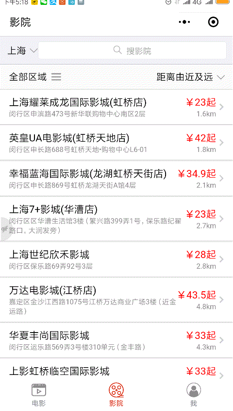
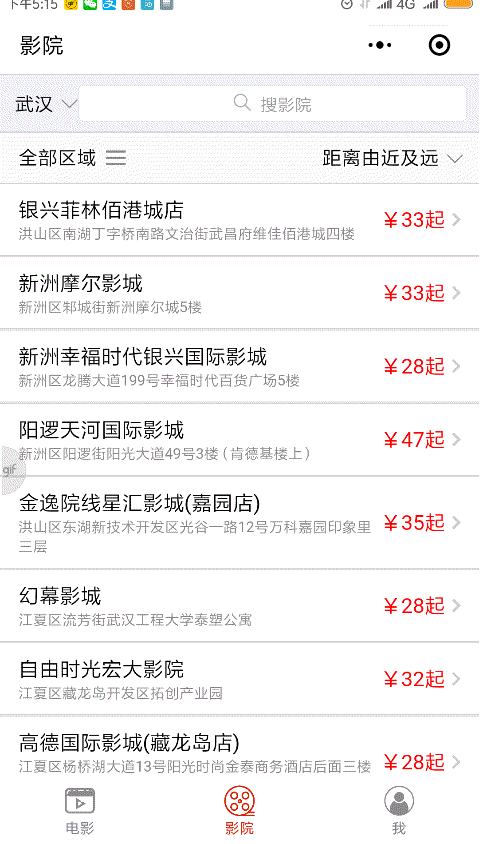
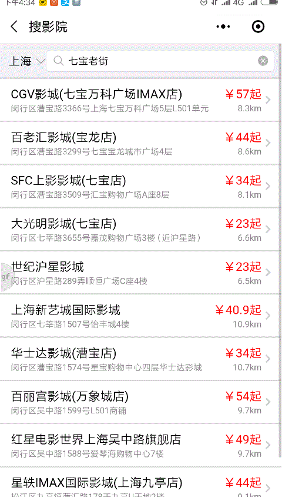

# hymp
惠电影小程序

## 扫描体验

mp核心功能分成三个Tab页：

- 电影列表，显示正在热映和即将上映的电影
- 影院列表，根据用户的位置由近及远显示影院列表
- 个人中心，用户推荐、反馈入口

## 电影列表

电影列表包含头部和主体两部分，头部是目前正在热映八部电影的海报以幻灯浮图的形式循环轮播，主体则根据电影上映时间划分成正在热映和即将上映两个子Tab电影列表。

### 热映浮图

一般影视网站首页都有最近热播视频幻灯视图，热映浮图与此类似，使用滑块试图容器[swiper](https://developers.weixin.qq.com/miniprogram/dev/component/swiper.html)轮番展示8部最近热门电影海报大图。

### 正在热映

正在热映列表是从豆瓣电影API分页获取所有正在热映的电影，和热映浮图一起构成惠电影首页视图。

热映列表中包含以下电影信息：

- 电影标题
- 电影海报小图
- 电影豆瓣评分
- 电影导演
- 电影演员
- 比价按钮，进入影院选择列表和比价详情页查看电影比价信息

单击电影列表项可进入电影详情也，查看当前电影详情信息。

#### 电影详情页

电影详情页展示的电影信息：

- 电影标题、海报、评分，同列表页
- 剧情摘要
- 导演、演员照片
- 剧照、预告片，单击预告片可播放
- 比价按钮，可选择具体影院查看电影比价信息入口

### 即将上映

与正在热映一样，只是分页展示的是即将上映的电影信息，列表项中无比价按钮，单击列表项同样可查看电影详情信息。正在热映和即将上映两个Tab位于同一container中，两个Tab随用户选择切换，同一时刻只有一个可展示。

使用[高颜值、好用、易扩展的小程序 UI 库vant-weapp](https://github.com/youzan/vant-weapp)中的zan-tab组件极大简化了Tab切换效果的实现。

## 影院

影院信息入口，可查看搜索影院，包括：

- 影院列表
- 影院搜索
- 城市选择

### 影院列表

根据微信定位的用户位置由近及远展示当前城市电影院名称、电影院位置、距离、最低价格，单击影院列表项可查看影院详情比价信息。

### 影院搜索

影院搜索框里用户可输入电影院名称或道路地址，借用百度map微信小程序js api提供的POI检索热词联想功能可根据用户的输入显示提示地址。用户输入或选择某个具体地址后，利用百度map逆地址解析将输入地址解析成经纬度，然后与当前城市所有影院计算距离排序后由近及远展示所有影院。

### 城市选择

惠电影使用微信sdk定位用户位置经纬度信息，然后使用百度map sdk由经纬度获取到具体城市，默认显示当前城市影院列表,可通过城市选择更换目的地城市。城市选择组件基于[citySelect](https://github.com/chenjinxinlove/citySelect)实现。

### 影院详情

- 影院详情地址
- 热映电影比较，是惠电影最核心的功能

##### 影院地址
展示影院详情地址，点击地址icon可打开地图查看位置和导航信息。

##### 电影比较

浮图形式展现当前影院热映电影海报，海报下方显示了电影名称、评分及详情的比价信息，滑动海报可切换热映电影比价信息。

比价信息按可售卖日期分成多个可切换Tab,每个tab以列表项显示了当前电影的开场时间、结束时间、放映厅、渠道最低价、语言等信息，点击列表项可查看/隐藏所有渠道的价格信息，目前有猫眼、淘票票、糯米三个渠道。

## 个人中心

个人中心包括当前登录用户信息以及惠电影分享推荐、联系客服和关于我入口项。

## Todo

- 电影搜索
- 影院按区域过滤、按价格排序
- 更多渠道方价格信息

